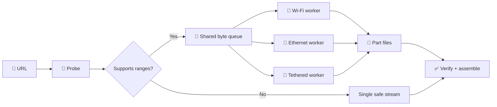
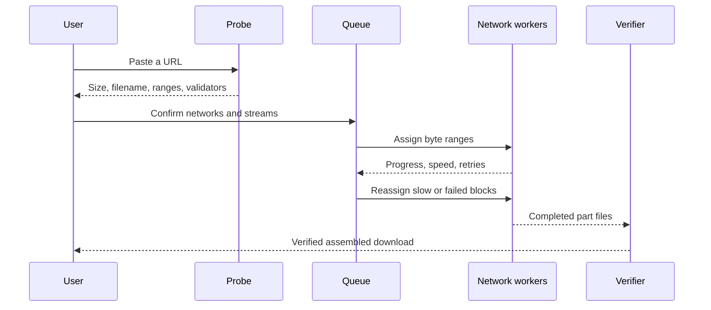
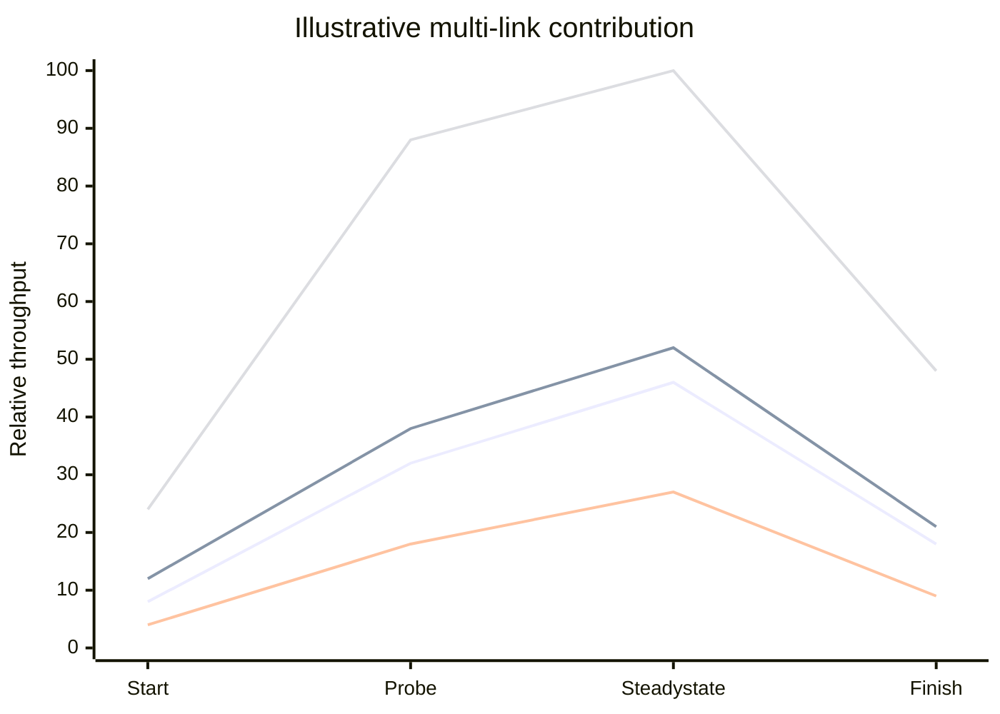
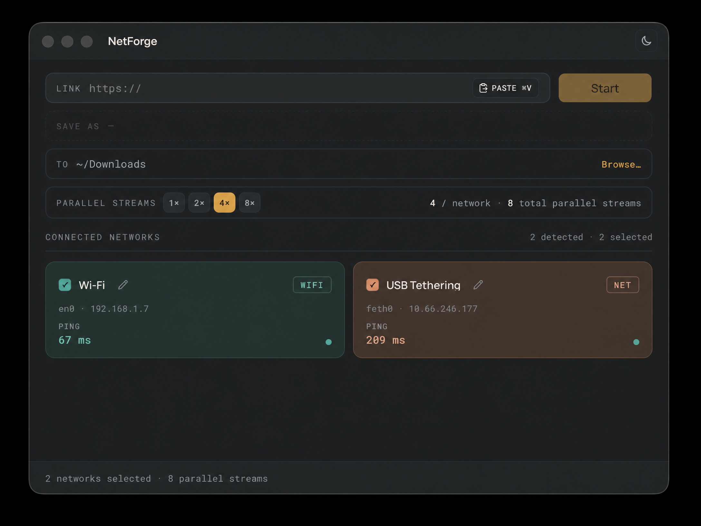
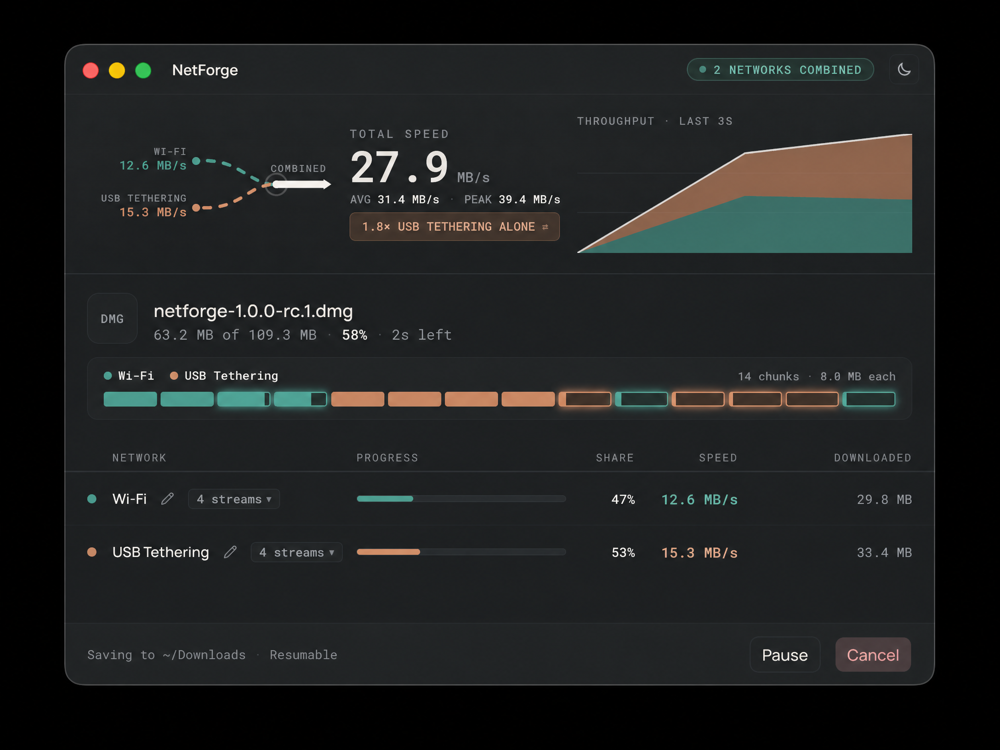
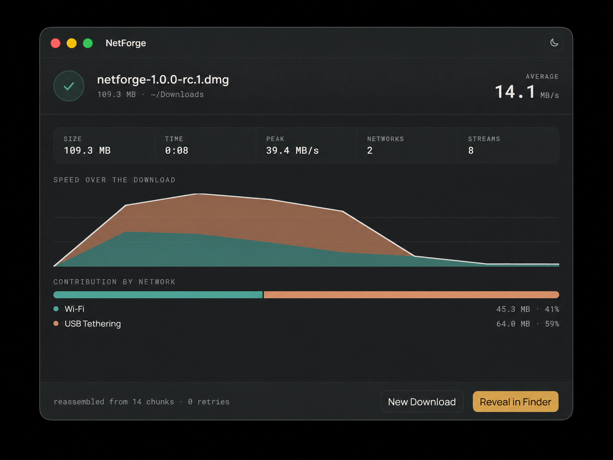
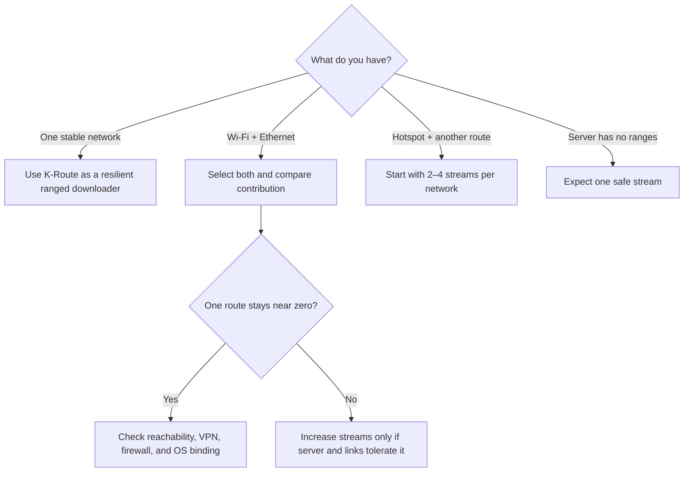

# K-Route

> **Use every connection. Finish one file.**

<p align="center">
  
</p>

<p align="center"><strong>⚡ A multi-link download workbench for Wi-Fi, Ethernet, and tethered connections.</strong></p>

K-Route is a cross-platform desktop download workbench for combining multiple network interfaces—Wi‑Fi, Ethernet, USB tethering, bridges, and other active adapters—into one coordinated download. Instead of assigning an entire file to one route, K-Route divides a ranged download into byte blocks, sends those blocks through selected interfaces, and assembles the verified result locally.

**Maintained by [Krish2214](https://github.com/krish2214).** K-Route is an independent renamed distribution based on the MIT-licensed Plexo codebase. The upstream license and attribution remain in [`LICENSE`](LICENSE).

## 🚀 Try it now

- **[Open the interactive project website](https://krish2214.github.io/k-route/)**
- **[Browse the source on GitHub](https://github.com/krish2214/k-route)**
- **[Open the latest public release](https://github.com/krish2214/k-route/releases)**
- **[Report a bug or request an improvement](https://github.com/krish2214/k-route/issues)**

The website includes a platform picker, live release search, direct download buttons, a system walkthrough, screenshot lightbox, theme switcher, copyable links, and an explanation of the transfer pipeline.

### Project at a glance



K-Route is not a VPN, proxy, bandwidth-bonding service, or cloud relay. The bytes travel directly from the origin to your machine; the application coordinates independent range requests and keeps the work visible.

## 🎯 What problem does K-Route solve?

A normal downloader usually opens one connection and leaves the operating system to choose one route. That is limiting when a computer has a fast Ethernet link, a separate Wi‑Fi connection, and a phone hotspot available at the same time. K-Route is designed for those situations.

K-Route does **not** magically merge bandwidth at the operating-system routing level. Instead, it uses several independent HTTP range requests. Each request is bound to a selected local interface where the operating system supports device binding. The responses are stored as separate part files and merged into the final file in byte order.

This approach is useful when:

- different networks have complementary speed or reliability;
- one route is congested while another remains healthy;
- a large file supports HTTP byte ranges;
- you want to see which network is contributing to a transfer;
- you need resumable downloads rather than a restart after interruption.

## 🧭 How the download works

```text
Paste URL
   │
   ▼
Probe server ──► follow redirects, detect size, filename, validators, range support
   │
   ▼
Plan blocks ──► create a shared queue of byte ranges
   │
   ▼
Route workers ──► bind requests to selected interfaces
   │
   ▼
Write parts ──► stream into independent temporary files with retry protection
   │
   ▼
Verify + assemble ──► validate ranges, merge in order, publish the completed file
```

### Transfer lifecycle graph



### 1. Probe

K-Route first checks the URL. It follows redirects, reads the suggested filename, detects the total size, checks whether the origin supports `Range` requests, and records validators such as `ETag` and `Last-Modified`.

If the origin does not support ranges or does not provide a known size, K-Route safely falls back to one stream rather than risking a corrupted multi-part file.

### 2. Plan

For a ranged download, the file becomes a shared queue of blocks. The current production planner uses blocks up to **16 MiB**, keeps a minimum block size to avoid excessive request overhead, and supports up to **32 streams total** with up to **8 streams per network**.

Workers are interleaved across networks when they start. A fast interface can later claim more available blocks through work stealing, while a stalled interface does not permanently own the rest of the file.

### Conceptual contribution graph

The chart below is illustrative, not a benchmark. It shows why a combined line can rise when independent routes contribute useful bytes at the same time.



### 3. Route

Each worker is assigned a selected network interface. On Linux, K-Route uses `SO_BINDTODEVICE` when available; on macOS and Windows it uses the local source address. This means each request can leave through the interface chosen for that worker instead of blindly following one default route.

If the operating system cannot provide reliable device binding, K-Route continues in safe source-address mode and reports the available interfaces in the application.

### 4. Transfer and speed

Every worker performs a byte-range request and writes its response to a temporary part file. Requests use byte-accurate validation, identity encoding for ranges, buffered writes, and reusable keep-alive connections where the server and route permit it.

The speed display is calculated from recent per-stream samples and then summed into a combined throughput value. The app also shows average speed, peak speed, per-network speed, contribution share, retries, active blocks, and an expandable stream view.

**Important:** the final speed depends on the origin server, CDN, HTTP range support, the quality of each route, OS permissions, disk speed, and whether the selected networks are truly independent. More streams can improve utilization, but too many streams can make a server or mobile hotspot slower. Start with the default four streams per network and adjust when testing a specific server.

### 5. Recovery and verification

A failed request returns its block to the shared queue. K-Route detects silent connections, retries failed ranges with backoff, refreshes connections that fall far behind their same-network peers, and can hedge a particularly slow block with another worker.

During pause/resume, the part files are treated as the source of truth. The app rechecks the server version, reconciles file lengths, and only assembles complete blocks. The assembling boundary is persisted immediately so a crash during reassembly can resume safely.

## 🖥️ Application interface

The desktop UI is organized around a compact transfer instrument panel:

| Area              | What it shows                                                                            |
| ----------------- | ---------------------------------------------------------------------------------------- |
| Start screen      | URL, paste action, destination folder, filename, selected networks, and stream count     |
| Network cards     | Interface name, address, type, selection state, and latency                              |
| Transfer hero     | Combined speed, average speed, peak speed, throughput chart, and network contribution    |
| Block grid        | Which byte ranges are pending, active, completed, retried, or assigned to a network      |
| Network table     | Per-network progress, share, speed, downloaded bytes, and expandable streams             |
| Footer actions    | Destination, resumability, retry count, pause/resume, and cancel                         |
| Completion screen | Final file details, elapsed time, peak speed, networks used, and reveal-in-folder action |

The theme toggle supports light and dark modes. Network names and colors can be customized so physical adapters remain recognizable across downloads.

### App screenshots

| Start with multiple routes                               | Watch active transfer                                        | Verify the finished file                                     |
| -------------------------------------------------------- | ------------------------------------------------------------ | ------------------------------------------------------------ |
|  |  |  |

## 🚦 Speed tuning checklist

If the measured speed is lower than expected, work through this list:

1. **Confirm the origin supports ranges.** A server without ranges is intentionally limited to one stream.
2. **Compare each network separately.** Test one selected interface at a time to identify a slow or unstable route.
3. **Start with 4 streams per network.** Try 8 only when the server and hotspot tolerate additional connections.
4. **Use a large file.** Small files finish before the workers can reach steady-state throughput.
5. **Check the disk.** Temporary parts and the final file can briefly require roughly twice the final size on one volume.
6. **Avoid VPN or proxy conflicts.** They may override source-address routing or collapse all requests onto one tunnel.
7. **Watch retries and stalls.** A high retry count usually indicates the route or server is the bottleneck, not the UI.
8. **Compare the per-network rows.** If one row stays near zero, that interface may be disconnected, blocked, or unsupported for device binding.

K-Route reports throughput; it cannot exceed the real capacity permitted by the server, selected networks, and local storage.

## ✨ What makes K-Route different?

| Difference                     | Why it matters                                                                                                                                  |
| ------------------------------ | ----------------------------------------------------------------------------------------------------------------------------------------------- |
| **Direct-to-origin transfers** | No account, relay server, subscription, or third-party bandwidth path is required.                                                              |
| **Interface-aware routing**    | Workers can use Wi-Fi, Ethernet, tethering, or another adapter instead of relying only on the default route.                                    |
| **One shared queue**           | Fast routes can claim more work while slow routes do not hold the download hostage.                                                             |
| **Part-file recovery**         | Interrupted work can resume from validated temporary parts instead of restarting from byte zero.                                                |
| **Visible contribution**       | The UI exposes per-network speed, bytes, share, retries, and active blocks instead of hiding everything behind one number.                      |
| **Safe failure behavior**      | Incorrect ranges, changed remote files, stalled connections, and unsupported servers are rejected instead of silently producing corrupt output. |

### Practical decision guide



## 📦 Downloads

The current public **[v1.0.0-rc.9 release](https://github.com/krish2214/k-route/releases/tag/v1.0.0-rc.9)** contains portable builds:

| Platform               | Artifact                                                                                                             |
| ---------------------- | -------------------------------------------------------------------------------------------------------------------- |
| Windows x64            | [Portable ZIP](https://github.com/krish2214/k-route/releases/download/v1.0.0-rc.9/NetForge-1.0.0-rc.9-win.zip)       |
| Windows ARM64          | [Portable ZIP](https://github.com/krish2214/k-route/releases/download/v1.0.0-rc.9/NetForge-1.0.0-rc.9-arm64-win.zip) |
| macOS Intel            | [Portable ZIP](https://github.com/krish2214/k-route/releases/download/v1.0.0-rc.9/NetForge-1.0.0-rc.9-mac.zip)       |
| macOS Apple Silicon    | [Portable ZIP](https://github.com/krish2214/k-route/releases/download/v1.0.0-rc.9/NetForge-1.0.0-rc.9-arm64-mac.zip) |
| Linux x86_64           | [AppImage](https://github.com/krish2214/k-route/releases/download/v1.0.0-rc.9/netforge-1.0.0-rc.9-x86_64.AppImage)   |
| Linux ARM64            | [AppImage](https://github.com/krish2214/k-route/releases/download/v1.0.0-rc.9/netforge-1.0.0-rc.9-arm64.AppImage)    |
| Debian / Ubuntu x86_64 | [.deb package](https://github.com/krish2214/k-route/releases/download/v1.0.0-rc.9/netforge_1.0.0-rc.9_amd64.deb)     |
| Debian / Ubuntu ARM64  | [.deb package](https://github.com/krish2214/k-route/releases/download/v1.0.0-rc.9/netforge_1.0.0-rc.9_arm64.deb)     |

The Windows and macOS artifacts are portable unsigned ZIP files. Native signed installers require signing on the respective operating systems. The source fixes in this repository are newer than the currently published rc.9 binaries; build from source or use the next release once published to receive the latest throughput changes.

## 🛠️ Build from source

Requirements: Node.js 22.12+ and npm 9+.

```bash
git clone https://github.com/krish2214/k-route.git
cd netforge
npm ci
npm run dev
```

Useful commands:

```bash
npm run typecheck       # Node, renderer, and E2E TypeScript checks
npm run build           # Production Electron build
npm run test:e2e:smoke  # Core download and recovery coverage
npm run lint            # ESLint
npm run format:check    # Prettier validation
npm run build:linux     # Linux package build
```

## Project structure

```text
src/main/download/       Range requests, scheduler, retries, persistence, assembly
src/main/network/        Interface discovery, latency, and device binding
src/main/ipc/            Typed Electron IPC handlers
src/renderer/src/        React screens, charts, network rows, and theme
src/shared/              IPC contracts, state types, and download planning
 e2e/                     Playwright smoke and recovery tests
docs/                     GitHub Pages product website
```

## Troubleshooting

**Only one stream appears:** the server likely does not support ranges, the file size is unknown, or the file is too small to benefit from splitting.

**A network shows zero speed:** confirm that the interface is connected, selected, and has a reachable address. On Linux, check that the packaged environment permits device binding. A VPN can also make several interfaces appear to share one route.

**The download retries repeatedly:** inspect the server response, CDN behavior, firewall, hotspot stability, and the per-network rows. K-Route intentionally rejects incorrect `Content-Range` responses instead of silently corrupting a file.

**Resume says the remote file changed:** restart the download when the origin has genuinely changed. K-Route compares validators and samples already-downloaded bytes to distinguish a relabelled CDN response from different content.

**The UI looks stale after a code change:** restart the Electron development process. The packaged release reads its own bundled renderer assets.

## 🌐 GitHub Pages website

The production site is published from `main/docs` at **[krish2214.github.io/k-route](https://krish2214.github.io/k-route/)**. It is a static, inspectable page with no backend dependency. To configure Pages manually, open **Repository → Settings → Pages**, choose **Deploy from a branch**, select `main`, and choose `/docs`.

The repository About homepage is configured to the same URL so visitors can find the deployed project directly from GitHub.

## Ownership, license, and attribution

K-Route branding, documentation, website presentation, and modifications in this repository are maintained by **Krish2214**. The upstream Plexo license and attribution are preserved because the project is based on that MIT-licensed codebase. See [`LICENSE`](LICENSE) for the complete terms.
